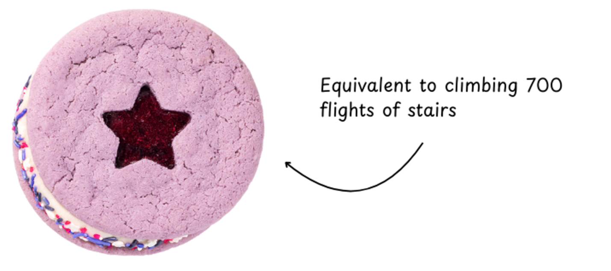

One day during the final exams week of my spring semester, freshman year of college, I asked to meet up with my friend, Michel, to study in the vicinity of each other (we didn’t actually share a class, but his presence was motivating). The location I had chosen was the seventh floor of New South, a modern building with large floor-to-ceiling glass windows that allowed for a nice view of the campus, which made studying for three back-to-back finals feel a little less stressful.

I arrived late, and tracking his location on my phone, I thought he was already waiting inside. Hurriedly, I went into the building, took the elevator up to the seventh floor, and found that…he wasn’t even in the room. Assuming he went to the wrong room, I walked back out just in time to see him appear out of the stairwell. As he gasped for breath, I asked him why he didn’t just take the perfectly functional elevator next to him, which would’ve saved him time and energy. He responded by telling me that taking the stairs was *more energy efficient* than wasting an entire elevator lift for just one person. Michel is a very environmentally conscious person, so I didn’t think much of it immediately, but as we sat down and began studying, I began to ponder the actual calculations on whether or not he was right. 

So, as a true scientist filled with curiosity (and not as a study-avoiding student), I present my analysis on the topic at multiple different levels of depth.  

## Level One: Basic Physics

So, at first glance, the physics seems simple. Regardless of how Michel or the elevator traveled, the amount of energy used depends solely on weight (since, in both scenarios, they’re traveling the same height). The weight of the elevator scenario would be the weight of the elevator plus the Michel system (Michel + clothes + backpack + other belongings), whereas the weight of the moving body in the stairwell scenario is just the weight of the Michel system, we must conclude that **Michel taking the stairs is more energy efficient.**

## Level Two: Mechanical Calculations

However, introductory high school physics often poorly models the world, which is understandably much more nuanced than a basic F=ma equation. Let’s try to figure out the exact energy expenditures of both scenarios.

Interestingly, in a 2012 study on determining the energy burned when climbing stairs [[1]](https://www.ncbi.nlm.nih.gov/pmc/articles/PMC3520986/), participants were found to burn an average of 8.62 kcal per 15 meters. Now, this study doesn’t relate directly to our scenario (the study included both males and females, had an average body mass lower than Michels, and Michel is generally a pretty fit guy, which would result in lower caloric burn), nonetheless, it was the best I could find from 30min of online scouring. Assuming an average floor height of 3 meters, Michel would’ve burned approximately 12 kcal, equivalent to 3 almonds, half a cup of cherry tomatoes, or ~1% of an Olivia Rodrigo GUTS Crumbl cookie. 

Based on empirical evidence on how slowly the New South elevator moves, I will assume that the elevator is a hydraulic type rather than an electric cable type. According to estimates from this article [[2]](https://slate.com/technology/2009/04/when-people-take-the-elevator-does-earth-get-the-shaft.html), a hydraulic elevator in a 3-story office building uses around 3,800 kWh per year, while one in a 10-story office building uses around ~21,000 kWh. Now, New South isn’t a proper office building and definitely faces less foot traffic than other spots on Campus (primarily due to its distance from the campus center). For these reasons, I estimate around a ~8,000 kWh annual usage for the elevators. Assuming around 70 lifts daily during the academic year and around 10 lifts daily during the summer season, that averages around 50 lifts per day. This means that each lift costs on average 0.44 kWh or 377 kcal (that’s almost 2/5th of a GUTS Crumbl cookie now!). While keeping in mind that this estimate depends on a multitude of assumptions, we see that o**nce again, taking the stairs is likely more energy efficient.**

## **Level Three: Energy Conversion Rates**

Now, this is where the crux of my original verbal argument lies. I never really intended to argue that the act of taking the stairs was less energy efficient than taking the elevator; instead, I aimed to prove that taking the stairs as a *human* was less energy efficient. Let me explain. 

When we think about energy efficiency, it's crucial to differentiate between the type of energy we're considering. Elevators consume electrical energy, while humans burn chemical energy stored in food. Although elevators are not perfectly efficient, the energy they consume is converted into potential energy with minimal losses compared to human metabolism. One analysis finds that lifts have an energy efficiency of >85% [[3]](https://liftescalatorlibrary.org/paper_indexing/papers/00000137.pdf). I will use this as my bottomline efficiency for lifts since I’ve seen on other places on the internet (Reddit) that motors/lifts are usually 90-98% efficient.

Humans, on the other hand, are notoriously inefficient at converting food energy into mechanical work. The human body is only about 20-25% efficient at converting food energy into mechanical work for activities like climbing stairs [[4]](https://openoregon.pressbooks.pub/bodyphysics/chapter/human-metabolism/). The rest is lost as heat and in other metabolic processes. This inefficiency means that Michel's body requires significantly more energy to climb the same set of stairs compared to the mechanical work done by the elevator to lift him.

This means the elevator consumes 444 kcal of electric energy while Michel needs around 48 kcal. **While taking the stairs as a single person is still more energy efficient at this level, we now can see that taking a full elevator would be more energy efficient.**

## Level Four: From the Sun
*At this point, I’ve already lost the argument and am extending the argument so far that its hardly recognizable, but I think it’s still interesting.*

All energy of Earth comes from one place: the sun. So let’s calculate how effectively we can actually convert solar energy from the Sun into the needed electric energy for the lift or food energy for Michel. While it’s hard to calculate the energy efficiencies of most energy sources from solar to electric (coal, for example, would be very difficult to calculate the solar efficiency), we’re in luck since Princeton has a strong commitment to going green and has pledged to have purely 100% renewable energy sources by 2050. So let’s assume the elevator in New South was powered by solar panels (it probably wasn’t). Most commercial solar panels have energy efficiencies of 17-20%, with some as high as 50% [[5]](https://www.notion.so/Does-taking-the-stairs-vs-the-elevator-save-energy-a9610fe37210481e85b28c47532e924e?pvs=21). Using the 20% estimate, this means that the elevator uses 2,220 kcal of solar energy.

On the other hand, we know that crops are wildly inefficient at converting solar energy into potential energy. Let’s assume that Michel has a purely corn-based diet (disgusting, I know). Cornfields have an energy efficiency of 1.5% [[4]](https://openoregon.pressbooks.pub/bodyphysics/chapter/human-metabolism/). This would mean Michel would need 3,200 kcal of energy. Aha! Finally, by looking at the source of all energy, we have proven that **taking the elevator is actually more energy efficient than taking the stairs.**

Take that Michel.
